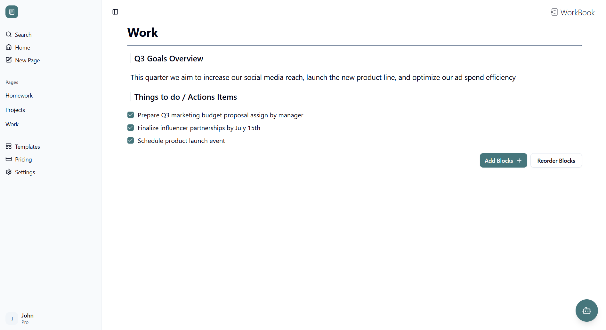
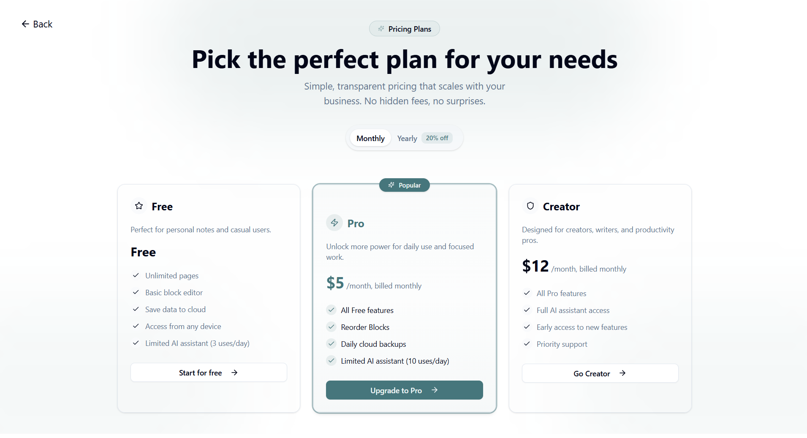

# 📓 WorkBook — Your Minimal Personal Workspace App

> A simple, minimalistic, personal web app to create, edit, and organize your ideas — built with **Next.js**, **Supabase**, and **Tailwind CSS**. Inspired by tools like Notion, WorkBook emphasizes user experience, performance, and scalable design.

---

## ✨ Project Overview

**WorkBook** is a **minimal personal workspace platform** designed for simplicity and speed.  
It allows authenticated users to create and manage pages, add editable blocks (paragraphs, headings, to-dos), and securely store data in a Supabase PostgreSQL database.

This project was built to deepen my practical skills in:
- **Full-stack architecture** with Next.js 13 App Router (server components, server actions)
- **Authentication & authorization** with Supabase Auth
- **Relational data design** for user pages and content blocks
- **UI/UX design** using Tailwind CSS and Framer Motion
- **Reusable, composable components** for scalable feature development
- **Stripe integration** for subscription management and role-based access
- **Gemini API integration** for AI-assisted workflows

---

## 📌 Features

✅ **Auth & Profiles** — Secure sign up, login, and profile creation (automatic fallback for usernames).  
✅ **Block-Based Editor** — Each page contains blocks: headings, paragraphs, to-dos, editable inline.  
✅ **Dashboard & Sidebar** — Sticky sidebar navigation for pages, quick actions, and user profile access.  
✅ **Create New Pages** — One-click “New Page” buttons with optimistic navigation.  
✅ **Recent Pages** — See recently updated pages in your dashboard.  
✅ **Responsive UI** — Built mobile-first, with smooth animations using Framer Motion. 
✅ **AI Assistant (Beta)** — Ask questions or extract summaries from your page content using Gemini API. 

---

## 🖼️ Screenshots






---
## ⚙️ Tech Stack

| Tech         | Details |
|--------------|---------|
| **Framework** | Next.js 13 (App Router, Server Actions, React Server Components) |
| **Database** | Supabase Postgres |
| **Auth**     | Supabase Auth (OAuth + Email/Password) |
| **Styling**  | Tailwind CSS |
| **Animation** | Framer Motion |
| **UI Library** | Custom + Shadcn UI Components |
| **Deployment** | Vercel |
| **AI Integration** | Gemini API (for page summarization, Q&A, and action extraction) |
| **Payments** | Stripe (Test Mode) |

---

## 📂 Project Structure

```plaintext
├── public
│   ├── screenshots
│   │   ├── authentication-page.png
│   │   ├── block-editor.png
│   │   ├── dashboard-page.png
│   │   ├── home-page.png
│   │   └── settings-page.png
│   ├── hero_image.svg
│   ├── idea_image.svg
│   ├── sign_in_image.svg
│   ├── sign_up_image.svg
│   ├── testimony1_image.jpg
│   ├── testimony2_image.jpg
│   ├── testimony3_image.jpg
│   └── testimony4_image.jpg
├── src
│   ├── actions
│   │   ├── ai-actions.ts
│   │   ├── create-page.ts
│   │   └── delete-page.ts
│   ├── app
│   │   ├── api
│   │   │   ├── checkout
│   │   │   ├── webhook
│   │   │   └── cancel-subscription
│   │   ├── auth
│   │   │   └── callback
│   │   ├── dashboard
│   │   │   ├── home
│   │   │   │   ├── loading.tsx
│   │   │   │   └── page.tsx
│   │   │   ├── pages/[id]
│   │   │   │   ├── loading.tsx
│   │   │   │   └── page.tsx
│   │   │   ├── settings
│   │   │   │   ├── loading.tsx
│   │   │   │   └── page.tsx
│   │   │   ├── page.tsx
│   │   │   └── layout.tsx
│   │   ├── pricing
│   │   │   └── page.tsx
│   │   ├── login
│   │   │   ├── loading.tsx
│   │   │   └── page.tsx
│   │   ├── register
│   │   │   ├── loading.tsx
│   │   │   └── page.tsx
│   │   ├── reset
│   │   │   └── page.tsx
│   │   ├── page.tsx
│   │   ├── not-found.tsx
│   │   ├── globals.css
│   │   └── layout.tsx
│   ├── components
│   │   ├── Providers.tsx
│   │   ├── ai-result.tsx
│   │   ├── ai-tools.tsx
│   │   ├── app-sidebar.tsx
│   │   ├── dashboard-layout.tsx
│   │   ├── editor.tsx
│   │   ├── home-content.tsx
│   │   ├── logo-sidebar.tsx
│   │   ├── nav-bar.tsx
│   │   ├── nav-projects.tsx
│   │   ├── nav-user.tsx
│   │   ├── settings-theme.tsx
│   │   ├── simple-pricing.tsx
│   │   ├── theme-provider.tsx
│   │   └── ui
│   │       ├── Logo.tsx
│   │       ├── avatar.tsx
│   │       ├── badge.tsx
│   │       ├── button.tsx
│   │       ├── card.tsx
│   │       ├── carousel.tsx
│   │       ├── checkbox.tsx
│   │       ├── dialog.tsx
│   │       ├── dropdown-menu.tsx
│   │       ├── input.tsx
│   │       ├── label.tsx
│   │       ├── mode-toggle.tsx
│   │       ├── select.tsx
│   │       ├── separator.tsx
│   │       ├── sheet.tsx
│   │       ├── sidebar.tsx
│   │       ├── skeleton.tsx
│   │       ├── sonner.tsx
│   │       ├── switch.tsx
│   │       ├── tabs.tsx
│   │       ├── textarea.tsx
│   │       └── tooltip.tsx
│   ├── hooks
│   │   └── use-mobile.ts
│   ├── lib
│   │   ├── prompts
│   │   │   ├── extract-actions.ts
│   │   │   ├── page-summary.ts
│   │   │   └── qna-page.ts
│   │   ├── constants.ts
│   │   ├── getUser.ts
│   │   ├── getSettings.ts
│   │   ├── getDashboardData.ts
│   │   ├── getPageData.ts
│   │   ├── getHomeData.ts
│   │   └── utils.ts
│   ├── middleware.ts
│   ├── types
│   │   └── index.ts
│   └── utils
│       ├── actions.ts
│       ├── helpers.ts
│       ├── checkRateLimit.ts
│       └── supabase
│           ├── client.ts
│           └── server.ts
├── README.md
├── components.json
├── eslint.config.mjs
├── next-env.d.ts
├── next.config.ts
├── package-lock.json
├── package.json
├── postcss.config.mjs
└── tsconfig.json

```

---

## 🚀 Getting Started

1. **Clone this repo**
   ```bash
   git clone https://github.com/KennyTangg/WorkBook.git
   cd WorkBook
2. **Install dependencies**
   ```bash
   npm install
3. **Set up environment variables**
   ```bash
   # Supabase
   NEXT_PUBLIC_SUPABASE_URL=your-supabase-url
   NEXT_PUBLIC_SUPABASE_ANON_KEY=your-anon-key
   SUPABASE_SERVICE_ROLE_KEY=your-service-role-key

   # Stripe (Test Mode)
   STRIPE_SECRET_KEY=your-stripe-secret-key
   STRIPE_WEBHOOK_SECRET=your-stripe-webhook-secret
   NEXT_PUBLIC_STRIPE_PUBLISHABLE_KEY=your-stripe-publishable-key

   # Gemini AI
   GOOGLE_API_KEY=your-gemini-api-key
4. **Run locally**
   ```bash
    npm run dev

## 🗂️ Database Schema (Basic Overview)

- **users** — managed by Supabase Auth
- **profiles** — user profile details (username, avatar, email)
- **pages** — each page belongs to a user (`user_id`) and has title, timestamps
- **blocks** — each block belongs to a page (`page_id`) and has type, content, position

---

## 🎯 Learning Goals

This project demonstrates:

✅ Simple full-stack web app skills  
✅ Next.js **Server Actions** and `app/` directory best practices  
✅ Handling **authentication & user profiles** with Supabase  
✅ Building **reusable, accessible UI** with Tailwind  
✅ State management for async operations, optimistic UI, and error handling  
✅ Clean project structure, type-safe components, and ESLint best practices

---

## 💳 Payments Integration (Test Mode)

**Stripe Checkout** has been integrated to allow subscription management (e.g., upgrading plans).  
Currently, Stripe is running in **Test Mode**, so **real payments are not processed**.

> ⚠️ This is a test environment. Use [Stripe test cards](https://stripe.com/docs/testing#international-cards) to simulate payments.

Plans are managed via the `/pricing` page, and users can "subscribe" to different tiers.